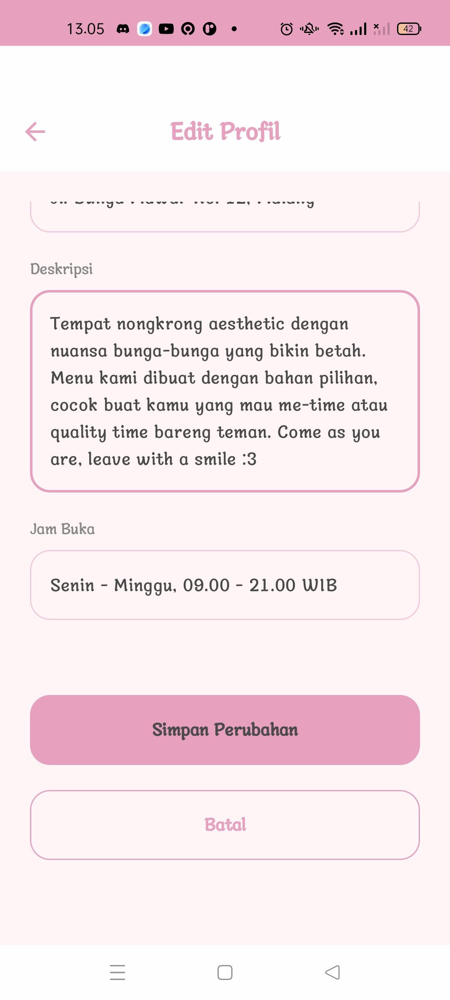
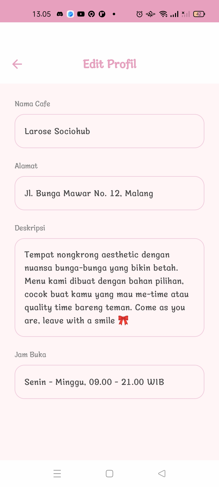
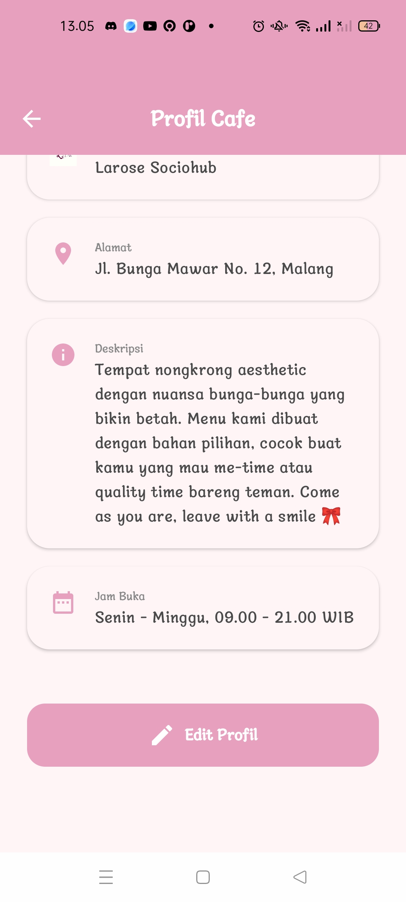
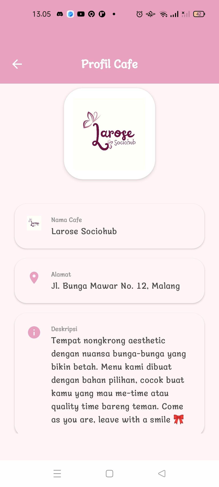
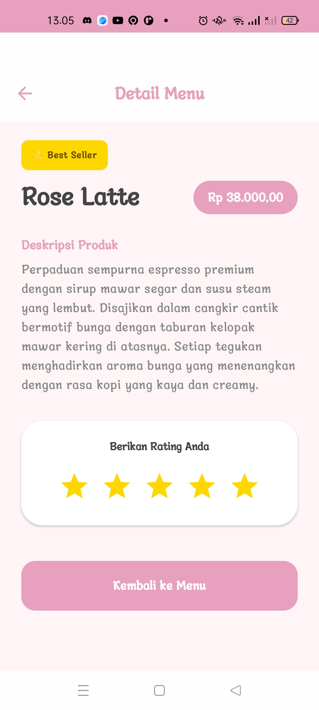
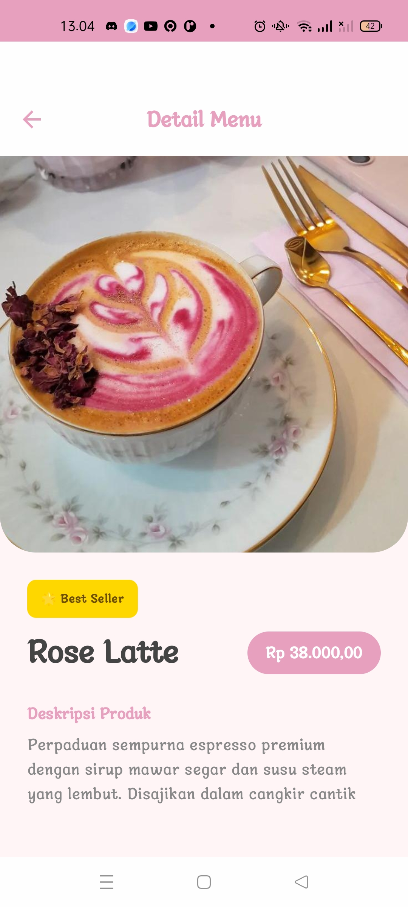
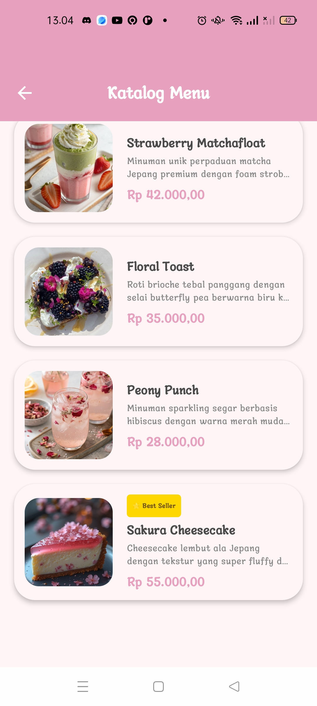
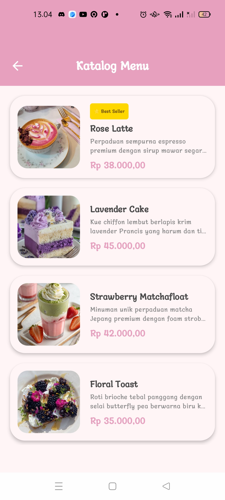
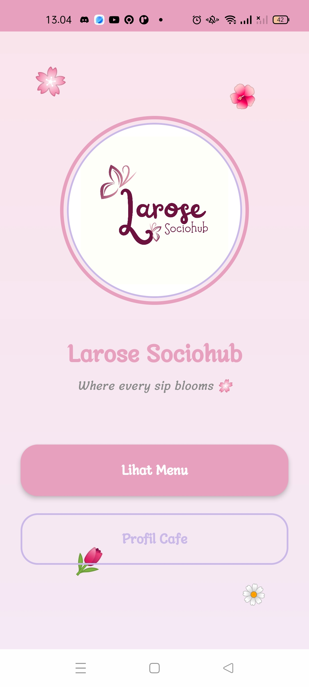
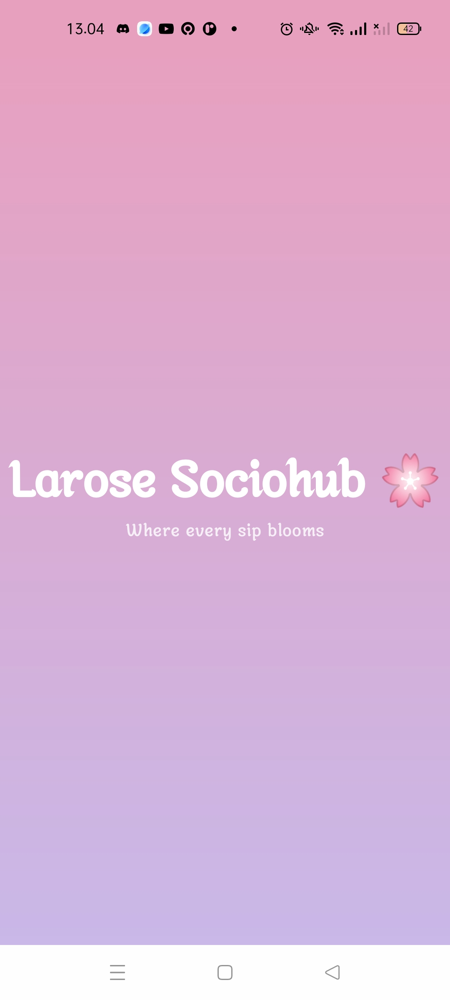

# Larose Sociohub 🌸

**Larose Sociohub** adalah aplikasi profil cafe estetik yang dibangun menggunakan **Jetpack Compose**. Aplikasi ini dirancang untuk memberikan pengalaman pengguna yang lembut dan menyenangkan dengan tema floral yang cantik.

## ✨ Fitur Utama
- **Home Screen**: Tampilan awal dengan animasi bunga yang melayang (floating animations).
- **Katalog Menu**: Daftar menu makanan dan minuman lengkap dengan status "Best Seller".
- **Detail Menu**: Informasi mendalam tentang setiap menu, termasuk deskripsi rasa dan sistem rating bintang.
- **Profil Cafe**: Informasi lengkap mengenai lokasi, jam operasional, dan deskripsi cafe.
- **Edit Profil**: Fitur untuk mengubah data cafe yang tersimpan secara lokal menggunakan SharedPreferences.

## 📸 Screenshots
Berikut adalah tampilan lengkap antarmuka aplikasi Larose Sociohub:

| Edit Profil (2) | Edit Profil (1) | Profil Cafe (2) |
|:---:|:---:|:---:|
|  |  |  |
| **Profil Cafe (1)** | **Detail Menu (2)** | **Detail Menu (1)** |
|  |  |  |
| **Katalog Menu (2)** | **Katalog Menu (1)** | **Home Screen** |
|  |  |  |
| **Splash Screen** | | |
|  | | |

## 🛠️ Teknologi yang Digunakan
- **Bahasa**: Kotlin
- **UI Framework**: Jetpack Compose
- **Navigation**: Compose Navigation
- **Local Storage**: SharedPreferences
- **UI Components**: Material Design 3

## 🚀 Cara Menjalankan Project
1. Clone repository ini.
2. Buka di **Android Studio Ladybug** atau versi terbaru.
3. Jalankan di Emulator atau Perangkat Android (API 24+).

---
*Dibuat dengan ❤️ untuk Larose Sociohub.*
